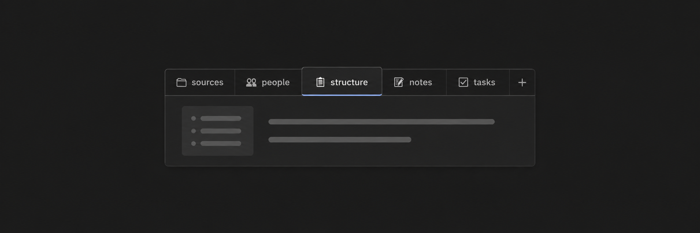

# Tabbed

[](https://obsidian.md/plugins?id=tabbed)
[](https://github.com/flowing-abyss/obsidian-tabbed/actions/workflows/release.yml)
[](https://github.com/flowing-abyss/obsidian-tabbed/releases)


Create accessible, lazy-loading tabs for Markdown content in Obsidian. Only the active tab body is rendered, so Bases, embeds, media and nested tabs load on demand. Works on desktop and mobile.

## Usage

Create a fenced `tabs` block. A line beginning with `tab: ` starts a new tab:

```tabs
tab: Preview
This tab contains **Markdown**.

tab: Details
Only the selected tab body is rendered.
```

Tab titles support Markdown, and active tab bodies can contain any Markdown content, including nested `tabs` blocks.

## Columns

Create equal columns with a fenced `columns` block:

```columns
column:
Left content.
column:
Right content.
```

Titles and weights are optional. Omitted weights are equal; use positive weights for proportions such as `2:1`:

```columns
column: Main
weight: 2
Main content.

column: Context
weight: 1
Context content.
```

Narrow rows scroll horizontally by default. Put `stack` before the first column to stack vertically when narrow:

```columns
stack
column:
Left content.
column:
Right content.
```

Columns support Markdown, Bases, embeds and nested layouts. Inside tabs, use tilde fences for the inner columns:

```tabs
tab: Dashboard
Full-width content.

~~~columns
column:
Recent notes.
column:
More recent notes.
~~~
```

Another enabled plugin using the `columns` fenced language may conflict.

## Options

Put options before the first `tab: ` line, separated by commas or newlines:

| Options                                    | Effect                                                      |
| ------------------------------------------ | ----------------------------------------------------------- |
| `top`, `bottom`, `left`, `right`           | Place the tab titles on that side of the active panel.      |
| `one`, `multi`                             | Keep titles on one scrollable line or allow multiple lines. |
| `action-add`, `action-edit`, `action-none` | Choose the control shown at the end of the tab list.        |

Horizontal tabs use Left/Right; vertical tabs use Up/Down. Home and End move focus, and Enter or Space activates a tab.

## Editing

- Add or edit tabs from the optional end control.
- Right-click a title to add, delete, copy or paste a tab.
- Optionally double-click the active body to edit it.
- Optionally drag titles to reorder or move tabs between blocks on desktop.
- Use normal Obsidian Undo to restore source changes.

Reading view keeps navigation and lazy rendering but hides source-changing controls. Drag-and-drop is desktop-only.

## Settings

Open **Settings → Tabbed** to configure the separator, new-tab defaults, controls, notices, editing behavior, title layout, border, content padding and maximum height.

## Installation

[Install Tabbed from the Obsidian Community Store](https://obsidian.md/plugins?id=tabbed).

## Credits

Tabbed is a compatibility-focused successor to Huajin's [Markdown Tabs](https://github.com/xhuajin/obsidian-tabs), which was inspired by [Code Tab](https://github.com/lazyloong/obsidian-code-tab).

## License

[MIT](LICENSE)
